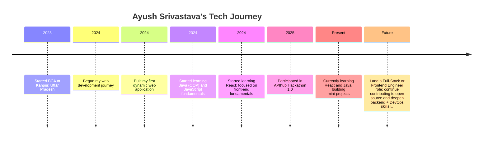

<h1 align="center">Hi there 👋, I'm Ayush Srivastava</h1>
<h3 align="center">💻 Web Developer | ☕ Java Learner | 🎓 BCA Student</h3>

  

  

---

## 📍 About Me  

🎓 **3rd-year BCA student** from Kanpur, Uttar Pradesh  
💻 Passionate about building **dynamic and user-friendly web applications**  
📚 Currently learning **React** and **Java**  
☁️ Exploring **cloud computing** and **DevOps fundamentals**  
🤝 Open to collaborating on **open-source projects** and **hackathons**  

---

## 🏅 Achievements & Highlights

- 🥇 **APIhub Hackathon 1.0** participant (2025)
- 🏆 Built multiple fun web games and mini projects
- 👨‍💻 **Consistent contributor** to open-source repositories
- 🌱 Always learning new tech and sharing knowledge with the community
- 🚀 Deployed projects on AWS and Netlify

---

## ✨ My Goals for 2025

- 🔥 Master Full-Stack Development (MERN & Java)
- 🧑‍🤝‍🧑 Collaborate on impactful open-source projects
- 📖 Publish technical articles and tutorials
- 🏢 Secure a Full-Stack or Frontend Developer role
- 🌱 Deepen skills in Backend and DevOps

---

## 🌐 Connect with Me

  
  
  
  

---

## 🛠️ My Tech Stack

  

---

## 🚀 My Journey

---

## 📊 GitHub Stats & Top Languages

  
  

---

## 🏆 Featured Projects

  

  

  

  

  

---

## 💡 Dev Quotes

  

---

## 🔥 Contribution Graph

  

---

  

---

  <b>Thanks for visiting! Let's connect, collaborate, and code something awesome together 🚀</b>

